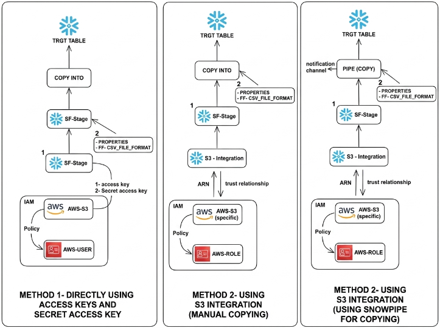

# snowflake_data_ingestion

# SQL Data Ingestion Guide

Data ingestion is the process of collecting raw data from various sources and moving it into a central place for storage and analysis. It serves as the foundational step in any data pipeline.

---

## 4 Ways to Ingest Data in SQL

| Method | Best For | Description |
| :--- | :--- | :--- |
| **1. Web Interface** | One-time manual uploads | Upload small files directly via the cloud console UI. |
| **2. SnowSQL (CLI)** | Local automation & scripting | Load data from local files using command-line interface commands like `PUT` and `COPY INTO`. |
| **3. Cloud Storage (S3)** | High-volume batch loading | Transfer large files directly from AWS S3, Google Cloud Storage, or Azure Blob. |
| **4. Snowpipe** | Near real-time streaming | Automate ingestion continuously as soon as new files arrive in cloud storage. |

---

## Ingesting from AWS S3 into Snowflake — 3 Approaches

The diagram below compares three ways to connect AWS S3 to Snowflake for loading data into a target table.

- **Method 1 — Directly using Access Keys and Secret Access Key**
  An IAM user with an attached policy grants an AWS-S3 access key and secret access key. These credentials are used directly in a Snowflake stage (`SF-Stage`), which then loads data via `COPY INTO` the target table.

- **Method 2 — Using S3 Integration (Manual Copying)**
  A Snowflake storage integration is created with an ARN and trust relationship to a dedicated AWS IAM role (rather than raw keys), scoped to a specific S3 bucket. The integration feeds a stage, and data is loaded manually with `COPY INTO`.

- **Method 2 — Using S3 Integration (Using Snowpipe for Copying)**
  Same trust relationship / IAM role setup as above, but instead of manual `COPY INTO`, a Snowpipe (`PIPE (COPY)`) listens on a notification channel and automatically loads new files as they land in S3 — enabling near real-time ingestion.

**Key takeaway:** Access keys are simplest but least secure (long-lived credentials); S3 integration with an IAM role is more secure via a trust relationship; adding Snowpipe on top automates the loading step for continuous, low-latency ingestion.
